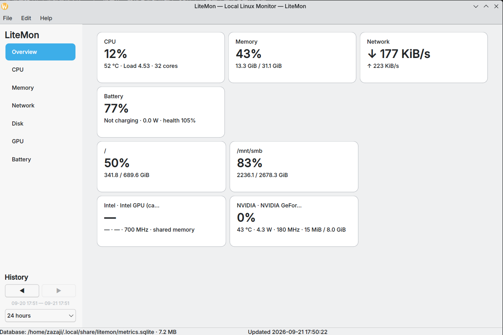
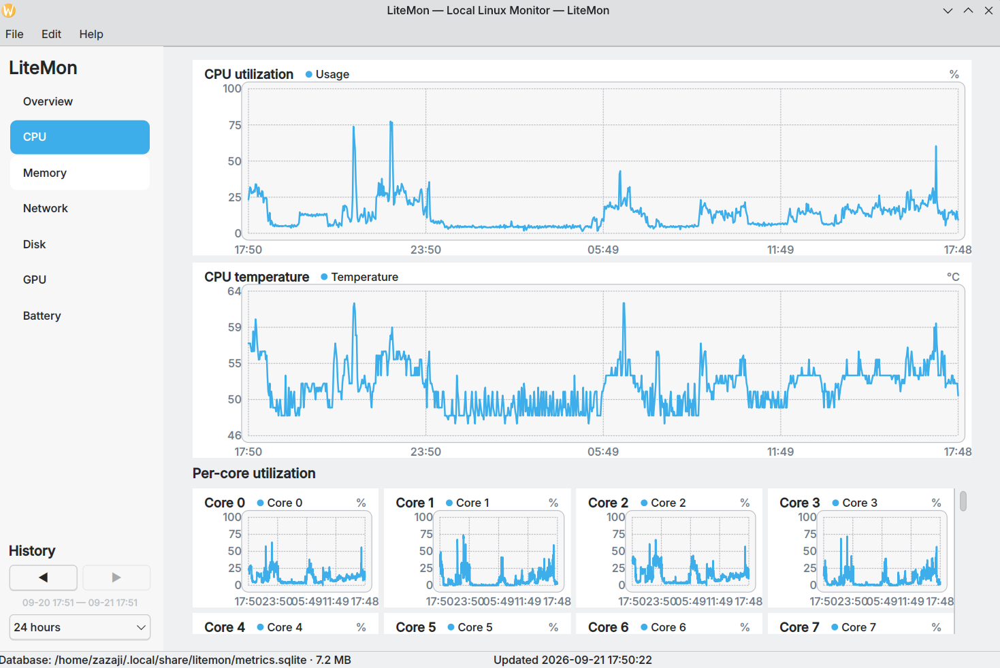
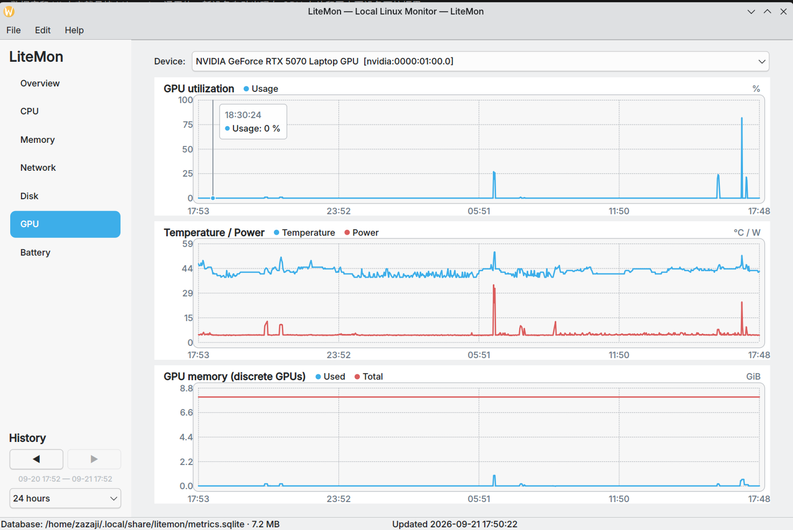

# LiteMon 2.0

[](https://github.com/user/litemon/actions/workflows/ci.yml)
[](LICENSE)

LiteMon is a lightweight, **single-machine**, local-first historical monitor for Linux desktops. It is designed for users who want useful long-term CPU/GPU/memory/network/storage/battery history without running Prometheus, Grafana, containers, a web server, or a remote service.



| CPU history | GPU history with click-to-pin crosshair |
|---|---|
|  |  |

## Highlights

- Native **C++20 + Qt 6 Widgets** UI; no WebEngine/QML dependency.
- **Interactive charts**: hover any history chart for a crosshair with per-series values; left-click pins it to the nearest sample showing the exact time and y values, Escape or a second click unpins.
- Small `litemon-collector` background process; GUI runs only when opened.
- SQLite WAL database with bounded retention and downsampling.
- CPU, load, temperature, memory, swap, network throughput, disk throughput and root filesystem usage.
- Laptop battery level, state, charge/discharge power and health.
- **NVIDIA** GPU utilization, VRAM, temperature, power and graphics clock via `nvidia-smi`.
- **Intel** GPU support through DRM/sysfs, `xpu-smi` for Xe/Arc where available, and `intel_gpu_top -J` fallback.
- **AMD** GPU utilization, VRAM, temperature, power and graphics clock via the `amdgpu` sysfs/hwmon interface (no extra tools needed).
- **Huawei Ascend NPU** name, temperature, power, AICore utilization and memory via `npu-smi`.
- Mixed vendors are represented as separate devices with separate history.
- NVIDIA runtime-suspend protection: sleeping Optimus dGPUs are not polled with `nvidia-smi` merely to draw a chart.
- CSV export, diagnostics JSON, database health check, settings, schema versioning and configurable retention.
- Debian 13-focused systemd user service, AppStream metadata, CPack packaging and CI.

## Architecture

```text
/proc  /sys  DRM  nvidia-smi  xpu-smi  intel_gpu_top  amdgpu  npu-smi
   \     |     |       |         |          |          |       /
                       litemon_core
             collectors · parsing · DB
                        |
             SQLite WAL + downsampling
                /                 \
 litemon-collector              litemon
 Qt Core + Qt SQL              Qt Widgets GUI
 always-on, low priority       open only when needed
```

The collector defaults to a 5-second system interval and 10-second GPU interval. Retention defaults are:

- fine detail: last 7 calendar days (minimum 6)
- compressed 5-minute averages: 365 days

All can be changed from **Edit → Settings** or `~/.config/litemon/litemon.ini`.

## Debian 13 quick start

```bash
sudo apt install build-essential cmake ninja-build qt6-base-dev libqt6sql6-sqlite
```

Optional Intel GPU detail:

```bash
sudo apt install intel-gpu-tools
```

NVIDIA metrics use the normal driver-provided `nvidia-smi`. Intel Xe/Arc can additionally use `xpu-smi` when installed.

Build, test and install for the current user:

```bash
./scripts/install.sh
```

Launch:

```bash
litemon
```

Collector status:

```bash
systemctl --user status litemon-collector.service
journalctl --user -u litemon-collector.service -f
```

## Diagnostics

One-shot hardware snapshot:

```bash
litemon-collector --snapshot
```

Runtime diagnostic report:

```bash
litemon-collector --diagnostics
```

Database and runtime health check:

```bash
litemon-collector --health-check
```

The GUI can also save a diagnostics JSON file from **File → Save diagnostics…**.

## Stable local paths

LiteMon follows the XDG base-directory convention and intentionally does not derive data paths from Qt organization metadata:

```text
~/.local/share/litemon/metrics.sqlite
~/.config/litemon/litemon.ini
~/.cache/litemon/collector.lock
```

`XDG_DATA_HOME`, `XDG_CONFIG_HOME` and `XDG_CACHE_HOME` are respected.

## Development

```bash
cmake --preset dev
cmake --build --preset dev
ctest --preset dev
```

Sanitizers:

```bash
cmake --preset asan && cmake --build --preset asan && ctest --preset asan
cmake --preset ubsan && cmake --build --preset ubsan && ctest --preset ubsan
```

Release build:

```bash
cmake --preset release
cmake --build --preset release
cpack --config build/release/CPackConfig.cmake
```

See [Architecture](docs/ARCHITECTURE.md), [GPU compatibility](docs/GPU.md), [Testing](docs/TESTING.md), [Contributing](CONTRIBUTING.md) and [Security](SECURITY.md).

## Installation

### From packages (recommended)

LiteMon provides native `.deb` (Debian/Ubuntu) and `.rpm` (Fedora/Rocky/AlmaLinux/RHEL) packages built by CI on every release tag.

**One-command repository setup (APT or DNF/YUM):**

```bash
curl -fsSL https://packages.litemon.dev/install.sh | sudo bash
sudo apt install litemon litemon-collector      # Debian / Ubuntu
sudo dnf install litemon                        # Fedora / Rocky / Alma / RHEL
```

**Manual APT setup (deb822 `.sources`, key in `/etc/apt/keyrings`):**

```bash
sudo install -d -m 0755 /etc/apt/keyrings
curl -fsSL https://packages.litemon.dev/key.gpg | sudo tee /etc/apt/keyrings/litemon.asc >/dev/null
sudo tee /etc/apt/sources.list.d/litemon.sources >/dev/null <<'EOF'
Types: deb
URIs: https://packages.litemon.dev/apt
Suites: trixie
Components: main
Signed-By: /etc/apt/keyrings/litemon.asc
EOF
sudo apt update && sudo apt install litemon litemon-collector
```

**Manual DNF/YUM setup:**

```bash
sudo tee /etc/yum.repos.d/litemon.repo >/dev/null <<'EOF'
[litemon]
name=LiteMon Repository
baseurl=https://packages.litemon.dev/rpm/$basearch
enabled=1
gpgcheck=1
gpgkey=https://packages.litemon.dev/key.gpg
EOF
sudo dnf makecache && sudo dnf install litemon
```

**Direct download from GitHub Releases:**

```bash
# Debian / Ubuntu (amd64, arm64)
wget https://github.com/zazaji/litemon/releases/latest/download/litemon_2.1.0_amd64.deb
sudo dpkg -i litemon_2.1.0_amd64.deb
sudo apt-get install -f   # fix any missing dependencies

# Fedora / Rocky / AlmaLinux / RHEL
wget https://github.com/litemon/litemon/releases/latest/download/litemon-*.x86_64.rpm
sudo dnf install litemon-*.x86_64.rpm
```

> Note: the `packages.litemon.dev` repository host is operated separately from
> GitHub Releases; until it is live, use the direct-download path above.

**Windows / macOS (unofficial builds):**

Cross-built on Linux, unsigned (no Apple developer certificate / code signing).
The Windows bundle is a portable folder — unzip and run `litemon.exe`.
The macOS app targets Apple Silicon (arm64) and is unsigned; on first launch,
right-click the app and choose **Open** to bypass Gatekeeper.

> Note: the `packages.litemon.dev` repository host is operated separately from
> GitHub Releases; until it is live, use the direct-download path above.

### Build from source

```bash
sudo apt install cmake ninja-build qt6-base-dev libqt6charts-dev
cmake --preset release
cmake --build --preset release
sudo cp build/release/litemon /usr/bin/
sudo cp build/release/litemon-collector /usr/bin/
```

### Running

The collector runs as a systemd user service:

```bash
systemctl --user enable --now litemon-collector.service
```

The GUI is a normal desktop application — run it from your app launcher or:

```bash
litemon
```

## Project principles

1. **Local-first**: no account, cloud, telemetry or external database.
2. **Low idle cost**: never wake hardware simply to monitor it when avoidable.
3. **Truth over decoration**: unsupported hardware readings remain unknown instead of fabricated.
4. **Bounded storage**: long history must not grow without limit.
5. **Graceful degradation**: missing GPU tools, sensors or battery fields must never break ordinary monitoring.
6. **Native Linux semantics**: `/proc`, `/sys`, DRM and systemd are first-class interfaces.

## Cross-platform status

| Platform | GUI | Collector | Status |
|----------|-----|-----------|--------|
| Linux (Debian 13) | ✅ | ✅ | Fully supported |
| macOS | 🔨 | ❌ | GUI compiles; collector needs porting (sysctl/IOKit) |
| Windows | 🔨 | ❌ | GUI compiles; collector needs porting (WMI/Performance Counters) |

The Qt6 Widgets GUI is cross-platform and compiles on macOS/Windows via GitHub Actions.
The system collector currently reads Linux-specific interfaces (`/proc`, `/sys`, DRM, `nvidia-smi`).
Porting the collector to macOS (sysctl, IOKit) and Windows (WMI, PDH) is planned.

## License

MIT. See `LICENSE`.
